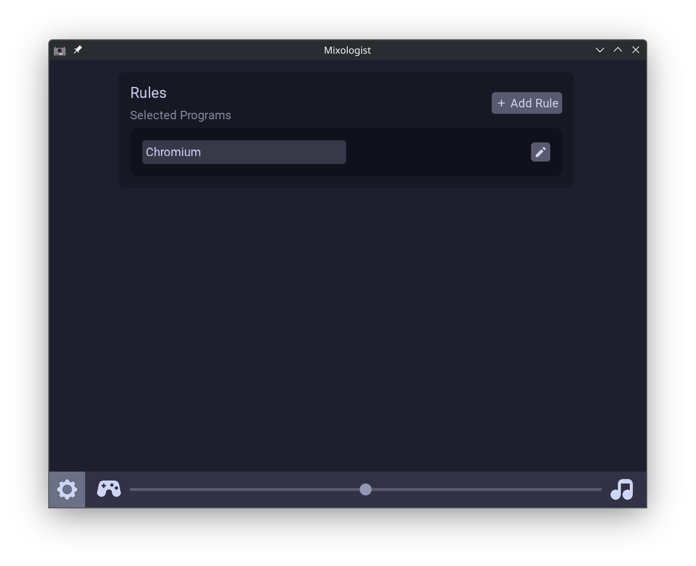
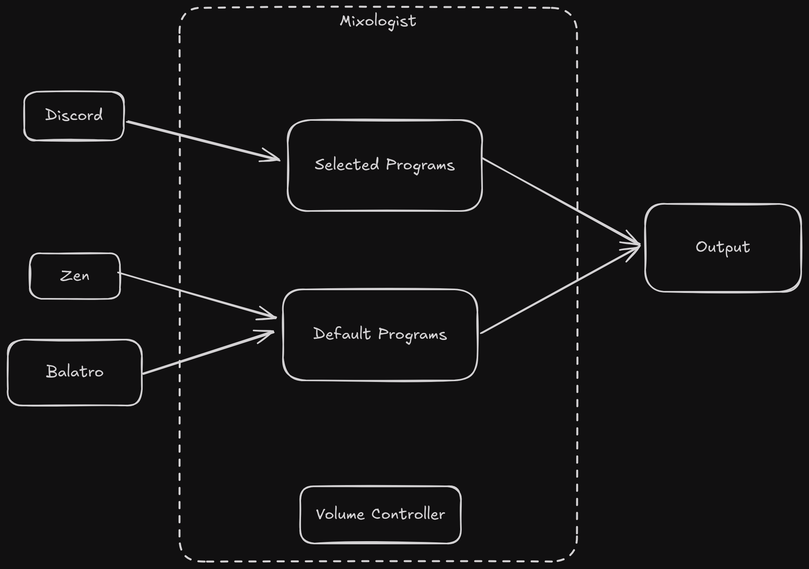

# Mixologist


A utility for mixing your audio between programs.
Experience changing audio levels without having
to dig through a volume mixer wtih quick and easy
program based filtering.

Mixologist uses [PipeWire](https://pipewire.org) to
rewire connections on the fly to two separate
channels as you see fit. Raise the volume of your
discord call and lower the volume of your game
without having to touch any audio settings.



---

> [!WARNING]
> This is **ALPHA** software, breaking changes
> will be kept to a minimum but are possible

## Getting Started
Mixologist can be installed via the latest 
[release](https://github.com/A1029384756/mixologist/releases).

### Building from Source
Dependencies:
- [Odin](https://odin-lang.org)
- `libdbus`
- `libpipewire`
- `sdl3`
- `sdl3_ttf`
- `sdl3_image`

```
$ make
$ sudo make install
```

## Usage
Mixologist can either be launched in GUI mode (default)
or daemon mode (`-daemon`). Once Mixologist is open,
`mixologist` can then be used as shown:
```
Flags:
        -add-program:<string>, multiple     | name of program to add to aux
        -daemon                             | start mixologist in daemon mode (no window)
        -get-volume                         | the current mixologist volume
        -remove-program:<string>, multiple  | name of program to remove from aux
        -set-volume:<f32>                   | volume to assign nodes
        -shift-volume:<f32>                 | volume to increment nodes
```

Mixologist exits to the tray and is "always running" unless
otherwise explicitly exited.

Mixologist can be controlled via global shortcuts that should
open on first launch, asking you to configure them.

If you don't have access to global shortcuts,
set keybinds in your desktop environment to the
corresponding command that you wish to
invoke. For example:
```
Shift + F10 -> mixologist -set-volume:0 #resets volume
Shift + F11 -> mixologist -shift-volume:-0.1 #balance one way
Shift + F12 -> mixologist -shift-volume:0.1 #balance the other way
```
If you are instead running the Flatpak, you should use
`flatpak run dev.cstring.Mixologist <flag>` to accomplish
the same result.

Volume is a single value that can range from -1 to 1 where:
- 0 is both channels at full volume
- 1 is only the programs in the "program list"
- -1 is only every other program

### Configuration
The config file resides at `~/.config/mixologist/mixologist.json`.
This is currently a JSON file of the following structure:
```json
{
	"rules": [
		"Chromium"
	],
	"settings": {
		"volume_falloff": 1,
		"start_minimized": true,
		"remember_volume": true
	}
}
```
The rules represent the set of programs you wish to isolate.
The config file is hot-reloaded and can be modified by the 
GUI or just editing it with your favorite text editor.

Volume falloff controls the curve used to set sink volumes
and is one of the following:
- Linear (default) -> 0
- Quadratic -> 1
- Power -> 2
- Cubic -> 3

Set the corrsponding *numeric* value in the config file.

## Planned Features
- [x] GUI
- [x] Flatpak distribution (GUI-only)
- [x] Proper settings menu
- [ ] Revamped theming system
- [ ] Improved Packaging for:
    - Debian
    - NixOS
